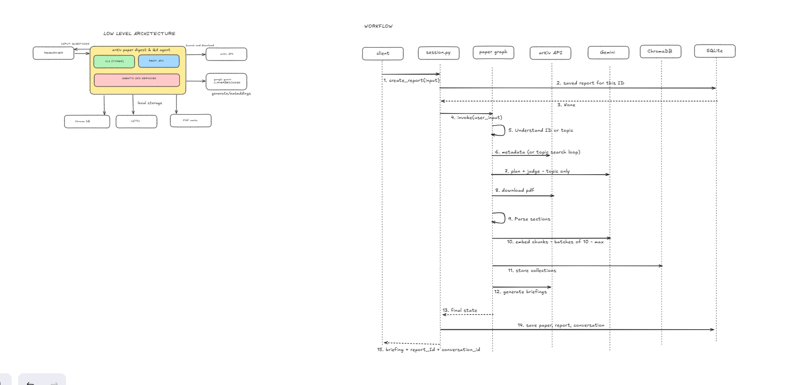
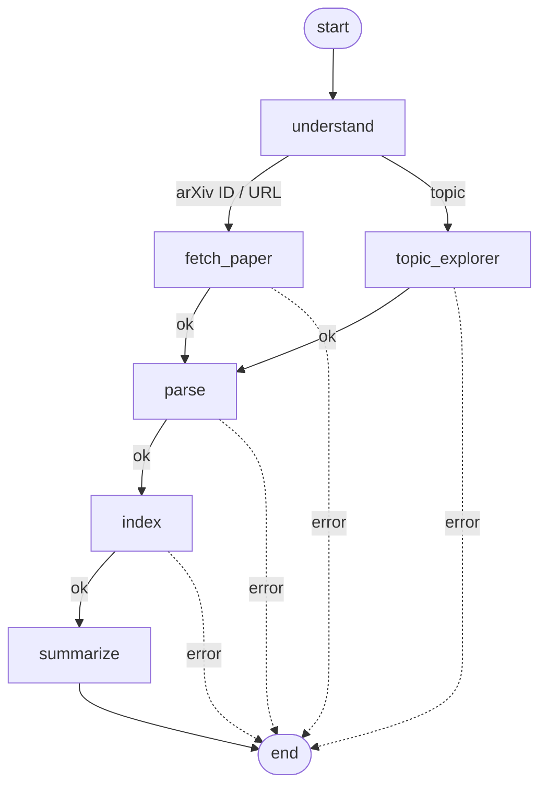
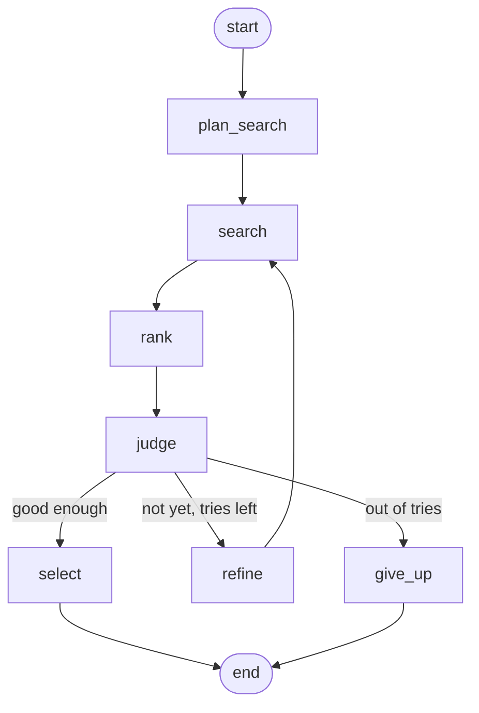
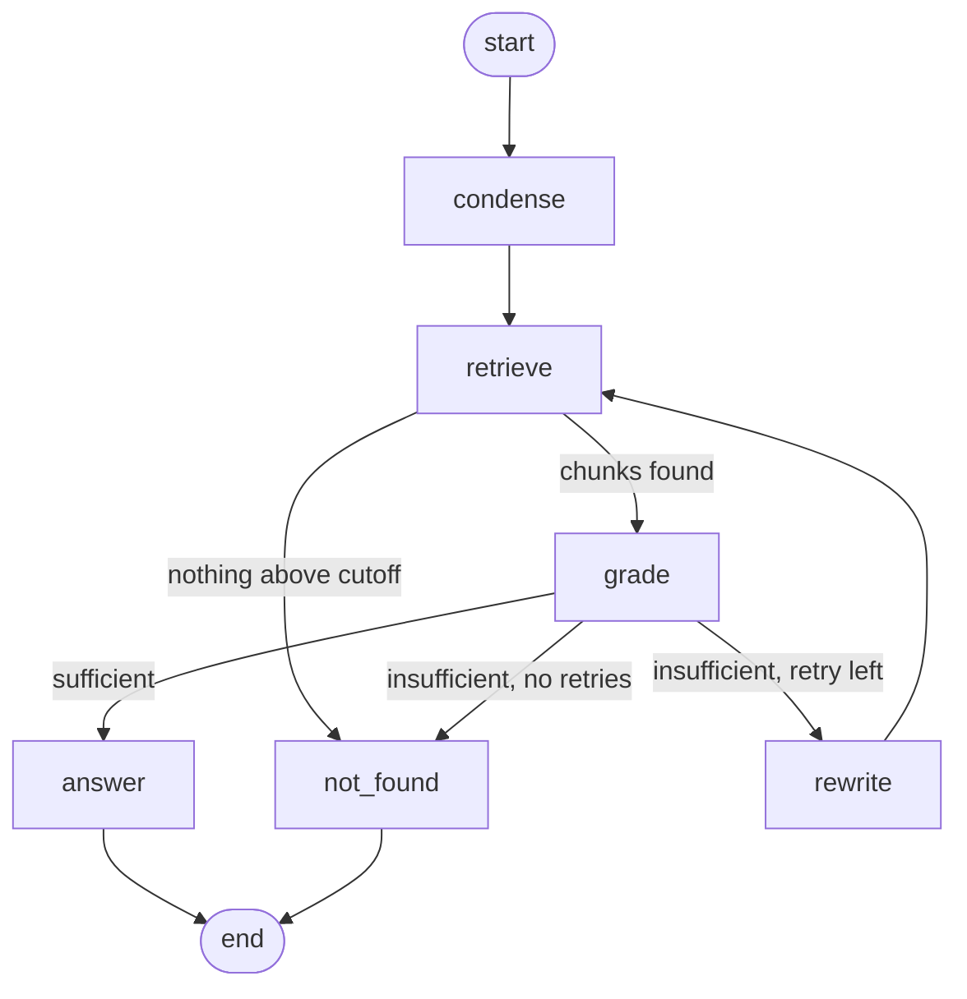

# arXiv Paper Digest & QA Agent

An agent that takes a **research topic** or an **arXiv ID/URL**, finds the paper, reads the PDF, and produces a structured **executive briefing**. You can then ask **follow-up questions** that are answered only from the paper, with citations, and the agent says so when the paper doesn't contain the answer.

```
python cli.py brief 1706.03762                                    # a specific paper
python cli.py brief "recent work on KV-cache compression for LLMs"  # a topic
```

Built with **LangGraph** (orchestration), **LlamaIndex** (retrieval), **Google Gemini** (LLM + embeddings), **ChromaDB** (vectors), **PyMuPDF** (PDF parsing), **SQLite** (sessions), **FastAPI** + a **Typer** CLI.

> **TODO before submitting:** replace the placeholders marked `TODO` (repo URL, video link, screenshots) and check the test count.

---

## Contents

1. [What it does](#what-it-does)
2. [Architecture](#architecture)
3. [Setup and run](#setup-and-run)
4. [Example run](#example-run)
5. [How answers stay grounded](#how-answers-stay-grounded)
6. [Failure handling](#failure-handling)
7. [Design decisions and tradeoffs](#design-decisions-and-tradeoffs)
8. [Known limitations](#known-limitations)
9. [What I'd do with more time](#what-id-do-with-more-time)
10. [Project structure](#project-structure)

---

## What it does

| Input | What happens |
|---|---|
| arXiv ID or URL (`2401.12345`, `https://arxiv.org/abs/2401.12345`) | Fetches that paper's metadata from the arXiv API |
| A topic (`"recent work on KV-cache compression"`) | A **topic explorer agent** searches arXiv, judges the results, refines its query if needed, and picks the best paper plus a shortlist |

Then, for the chosen paper:

1. **Parse**: download the PDF and split it into sections (including a lettered appendix), separating out the references.
2. **Index**: chunk each section, embed the chunks, store them in a per-paper ChromaDB collection.
3. **Brief**: generate a structured briefing (JSON and Markdown): title, authors, arXiv ID, date, link, *why it matters*, problem, method, key results, **limitations (required, labelled stated/inferred)**, and suggested questions.
4. **QA**: a **QA agent** answers follow-up questions from retrieved chunks only, with section and page citations, and refuses when the paper doesn't address the question.

Briefings and conversations are saved in SQLite, so a conversation can be resumed later.

---

## Architecture



*Left: components and storage. Right: the call sequence for creating a briefing (`create_report` → paper graph → saved paper, report and conversation).* [Open the editable diagram in Excalidraw](https://excalidraw.com/#json=9rjiwlcYRuvncu-ESSK5P,Bd6EO9cOtQEoAGVxx0fGpA).

### Layers

```
cli.py  ─┐
         ├─→ agents/session.py ─→ LangGraph graphs ─→ services ─→ arXiv API · PyMuPDF · ChromaDB · Gemini
api/    ─┘       (persistence)      (control flow)     (work)
```

Dependencies only point one way: `api / cli → agents → services → core / models`. Services never import LangGraph or FastAPI, so each one can be used and tested on its own. **LangGraph owns control flow and state; LlamaIndex owns retrieval.**

### Graph 1: Paper graph



Both input paths converge at `parse`: the topic explorer's only contract is to put a `paper` into the state. Every node that can fail routes errors to the end, so later nodes never run on missing data.

### Graph 2: Topic explorer agent



| Node | Kind | Job |
|---|---|---|
| `plan_search` | LLM | Topic → 2–4 essential keywords; detects "recent/latest" → sort by date |
| `search` | arXiv API | Up to 10 candidates |
| `rank` | Embeddings | Cosine similarity between the topic and each title + abstract |
| `judge` | LLM | Which candidates are relevant, which is best, is it good enough; if not, a **new** query (it sees all tried queries) |
| `refine` | — | Sets the new query and loops back to `search` |
| `select` / `give_up` | — | Best paper + shortlist, or a clear error listing what was tried |

Max 3 attempts. If attempts run out but something relevant was found, it selects the closest match with a warning. (Error edges after each node are omitted from the diagram for readability.)

### Graph 3: QA agent



| Node | Job |
|---|---|
| `condense` | Rewrites a follow-up ("how many heads does *it* use?") into a standalone question using the conversation history. No LLM call without history |
| `retrieve` | Top-5 chunks from the paper's Chroma collection, filtered by a similarity cutoff |
| `grade` | LLM checks whether the chunks actually contain the answer |
| `rewrite` | New search query using the paper's likely wording, informed by the grader's reason |
| `answer` | Answer citing numbered chunks; citations are validated |
| `not_found` | "The paper does not appear to address this question." |

Off-topic questions (nothing above the cutoff) are refused immediately, with no retry. Only "related but insufficient" retrieval gets one rewrite (max 2 retrievals, max 4 LLM calls per question).

### State shape

**`PaperState`** (paper graph)

| Key | Set by | Notes |
|---|---|---|
| `user_input` | caller | |
| `intent`, `arxiv_id`, `query` | `understand` | `paper_id` or `topic` |
| `paper`, `candidates` | `fetch_paper` / `topic_explorer` | `PaperMeta`; shortlist for topics |
| `parsed` | `parse` | sections, references, `parse_quality`, warnings |
| `collection_name` | `index` | Chroma collection |
| `briefing` | `summarize` | `Briefing` |
| `error`, `failed_node` | any node | stops the graph |
| `warnings`, `steps` | many nodes | **reducer** (`operator.add`): lists are appended, not replaced |

**`ExplorerState`** keeps its internals (`attempts`, `tried_queries`, `judgment`) to itself. It is run *inside* the `topic_explorer` node with explicit inputs and outputs, rather than as a directly attached subgraph, to avoid reducer keys (`steps`) being duplicated between the two graphs.

**`QAState`** keeps three versions of the question: what the user typed (displayed), the **standalone** question (used for grading and answering), and the **search query** (sent to Chroma; may be rewritten on retry).

### Where state lives

| What | Where | Lifetime |
|---|---|---|
| Graph state | Memory | One graph run |
| Chunk vectors | ChromaDB (`data/chroma`), one collection per paper | Permanent |
| Papers, briefings, conversations, messages | SQLite (`data/app.db`) | Permanent |
| Downloaded PDFs | `data/pdfs` | Permanent cache |

The QA stage never needs the paper graph's state: a conversation stores its `arxiv_id` (→ which Chroma collection to search) and its messages (→ history for follow-ups). `agents/session.py` is the only module that connects the graphs to the database.

---

## Setup and run

### Requirements

- Python 3.12 or 3.13 (developed on 3.13)
- A Google Gemini API key from [Google AI Studio](https://aistudio.google.com). No other keys or services are needed; ChromaDB and SQLite run locally.

### Install

```bash
git clone TODO-your-repo-url
cd ai-project
python -m venv .venv
# Windows: .venv\Scripts\activate      macOS/Linux: source .venv/bin/activate
pip install -r requirements.txt
cp .env.example .env                    # Windows: copy .env.example .env
```

Edit `.env` and set `GEMINI_API_KEY`. Model names are configurable there (`LLM_MODEL`, `EMBED_MODEL`), because Gemini model availability changes over time.

### CLI

```bash
python cli.py brief 1706.03762            # brief a paper, then chat about it
python cli.py brief "recent work on speculative decoding" -v    # topic; -v shows the agent's steps
python cli.py brief 1706.03762 --no-chat  # briefing only (reuses a saved briefing instantly)
python cli.py brief 1706.03762 --refresh  # force a new briefing
python cli.py chat <conversation_id>      # resume a saved conversation
python cli.py list                        # saved briefings
```

### API

```bash
uvicorn backend.main:app --reload
```

Interactive docs at **http://localhost:8000/docs**.

| Method | Path | Purpose |
|---|---|---|
| GET | `/health`, `/system/info` | Health, models and settings in use |
| POST | `/explore` | Run the topic explorer only: chosen paper, shortlist, tried queries |
| POST | `/reports` | `{"input": "1706.03762"}` → briefing + `report_id` + `conversation_id` |
| GET | `/reports`, `/reports/{id}`, `/reports/{id}/markdown` | Saved briefings |
| GET | `/papers/{arxiv_id}` | Saved metadata, indexed or not, its reports |
| POST | `/conversations` | New conversation for an existing report |
| POST | `/conversations/{id}/messages` | `{"question": "..."}` → grounded answer with citations |
| GET | `/conversations/{id}` | Full history |

Errors always return `{"error": "<Type>", "detail": "..."}`: **404** unknown paper/report/conversation, **422** no result could be produced (e.g. no papers for a topic), **502** an upstream service (Gemini/arXiv) failed.

### Tests and demo

```bash
python -m pytest -v          # unit tests: no network, no LLM, no API key needed
python -m demo.run_demo      # reproducible example run -> demo/example_run.md
```

### Rate limits and timing (please read before testing)

- **First briefing of a paper takes ~30–60 s** (download, embed, summarize). Repeat requests for the same arXiv ID reuse the saved briefing with zero LLM calls.
- **Gemini** can return `429 RESOURCE_EXHAUSTED` or `503 UNAVAILABLE` during demand spikes, even well below account limits (observed on a Tier 1 project at ~2.5% of its quota). All LLM calls retry with exponential backoff (5 attempts, 2–30 s); embeddings are sent in batches of 10 with a 1 s pause and retry up to 6 times (2–60 s). On the free tier, expect occasional retry warnings; runs normally continue.
- **Typical Gemini calls:** briefing 1; topic search 2–4; each question 0–4 (0 when refused by the similarity cutoff).
- **arXiv:** requests are spaced ≥3 s apart, as arXiv asks, so topic searches take a few extra seconds per attempt.

---

## Example run

Full, reproducible transcript: **[`demo/example_run.md`](demo/example_run.md)** (generated by `python -m demo.run_demo`). Screenshots of the API: `demo/` (TODO: add `api_docs.png`, `api_answer.png`, `api_error.png`).

### Input: `1706.03762` ("Attention Is All You Need")

Graph steps: `understand -> fetch_paper -> parse -> index -> summarize`

Briefing (excerpt):

> **Key results**
> - The big Transformer achieved a state-of-the-art BLEU score of 28.4 on the WMT 2014 English-to-German translation task, outperforming prior best results and ensembles by over 2.0 BLEU.
> - On the WMT 2014 English-to-French task, the big model achieved a single-model state-of-the-art BLEU score of 41.8 after training for 3.5 days on eight P100 GPUs.
>
> **Limitations**
> - When sequence length n is larger than the representation dimension d, self-attention layers are computationally more expensive per layer than recurrent layers. *(stated)*
> - While training is highly parallelizable, output sequence generation during inference remains auto-regressive and sequential step-by-step.

All numbers in this briefing were checked against the paper. It does not mention later work (BERT, GPT), which the model knows about but the paper does not contain.

QA exchanges:

> **Q:** How many layers does the encoder have?
> **A:** The encoder is composed of a stack of 6 identical layers [1].
> *[1] 3.1 Encoder and Decoder Stacks (p.3)*
>
> **Q:** And how many attention heads does it use?
> *(condensed to: "How many attention heads does the encoder use?")*
> **A:** The model employs 8 parallel attention heads [2]. Within the encoder stack, each layer utilizes a multi-head self-attention sub-layer [1][3].
> *[1] 3.1 Encoder and Decoder Stacks (p.3) · [2] 3.2.2 Multi-Head Attention (p.4) · [3] 3.2.3 Applications of Attention in our Model (p.5)*
>
> **Q:** How much did training cost in dollars?
> *(steps: condense → retrieve → grade → rewrite → retrieve → grade → not_found; retry query: "estimated dollar cost training USD")*
> **A:** The paper does not appear to address this question.
> *(Grader: the excerpts measure training cost in GPU time and FLOPs, but do not state a dollar cost.)*
>
> **Q:** What is the capital of France?
> *(steps: condense → retrieve → not_found; best similarity 0.632 < cutoff 0.70, so no LLM call)*
> **A:** The paper does not appear to address this question.

### Topic inputs (topic explorer)

| Topic | Attempts | Queries tried | Result |
|---|---|---|---|
| `recent work on KV-cache compression for LLMs` | 1 | `KV cache compression LLMs` (sorted by date) | A recent KV-cache compression paper + 2 more in the shortlist |
| `the paper that introduced the Transformer architecture` | 2 | `Transformer architecture attention mechanism` → `ti:"Attention Is All You Need"` | **1706.03762**: the judge realized the first results *use* Transformers and switched to a title search |
| `quantum flurbonic hyperwidgets for sandwich folding` | 3 | progressively broader queries | Clean error listing all tried queries |

---

## How answers stay grounded

1. **Similarity cutoff (0.70).** Tuned on real scores: answerable questions scored 0.80–0.82, on-topic-but-unanswered 0.75–0.79, off-topic 0.63. The cutoff stops clearly off-topic questions for free and lets everything on-topic reach the grader.
2. **LLM grader.** Decides whether the retrieved chunks *contain the specific information asked for*. This catches the case similarity can't: "How much did training cost in dollars?" scores 0.79 (the paper discusses training cost in FLOPs), but the grader correctly rejects it. The prompt is strict about the **topic**, not the **format**: limitations mentioned in the conclusion count; FLOPs don't answer a question about dollars.
3. **Answer rules + citation check.** The answer prompt forbids outside knowledge ("even if you know the answer"; Gemini knows this paper) and requires `[n]` citations. Answers with no valid citations are refused. For partial answers, the agent says what the paper doesn't state.

The **briefing** is grounded too: metadata (title, authors, date, link) comes from the arXiv API and is never generated; the prompt forbids outside knowledge; limitations are required by the schema; and a **number check** flags numbers in the results that don't appear verbatim in the paper text.

---

## Failure handling

The brief's §5 questions, and how they're handled:

| Situation | Handling |
|---|---|
| **Zero results** for a topic | The judge sees an empty list and proposes a broader query; after 3 attempts, a clear error with all tried queries |
| **Many / off-topic results** | Embedding ranking + LLM judge pick only genuinely relevant papers; otherwise a more specific query |
| **LLM writes an invalid arXiv query** (HTTP 400) | Treated as a failed attempt (0 results), not a fatal error; the loop continues |
| **Unknown arXiv ID** | `PaperNotFound` → graph stops at `fetch_paper` → 404/422 with a clear message |
| **Scanned / image-only PDF** | Detected by low text per page → falls back to the abstract, `parse_quality="abstract_only"`, warning shown |
| **Broken layout** (no headings found) | Falls back to one section per page (`parse_quality="partial"`); QA still works with page citations |
| **Huge paper** | First 60 pages parsed; briefing input capped at 120k characters (appendix is cut first); warnings shown |
| **Gemini 429/503** | Exponential backoff on every LLM and embedding call |
| **A node fails after retries** | The `graph_node` decorator turns known errors into `state["error"]`; conditional edges route to the end; the API maps the error to a status code. Unexpected bugs still crash loudly instead of being hidden |
| **Grounding** | See the section above |
| **State between summary and QA** | SQLite (conversations, messages) + ChromaDB (vectors); see "Where state lives" |

---

## Design decisions and tradeoffs

**LangGraph + LlamaIndex, one orchestrator.** LangGraph's explicit nodes/edges/state map directly onto the required state graph; LlamaIndex handles chunking, embeddings and the Chroma adapter. I used LlamaIndex only for retrieval, not its Workflows, to avoid two competing orchestration layers.

**Agentic where judgment helps, deterministic where reliability matters.** Parse → chunk → index is plain code. LLM decisions are used only where a fixed rule can't work: judging search results, grading retrieval, condensing follow-ups. Decisions live in small **router functions**, which makes every branch unit-testable without an LLM.

**Custom PDF section parser (regex + rules) instead of font-size detection.** Built iteratively from real output: PyMuPDF puts `3.1` and its title on separate lines (two-line headings); table values like `91.7` looked like headings (fixed by accepting only a *plausible next* section number); the appendix sits after the references and has its own table of contents (detected and skipped). Font-size detection is the upgrade path if more layouts fail.

**Section-aware chunking.** 700-token chunks with 100 overlap, never crossing a section boundary; the section title is included in the embedding text (page number and ID are not). References are excluded from the index because they match queries without being the paper's content.

**Full paper in one briefing call (no map-reduce).** Gemini's context window fits whole papers; one call keeps cross-section context and costs one request. Capped at 120k characters.

**Gemini-only.** One API key for everything keeps setup simple for graders. Gemini embeddings hit transient 429s even at ~2.5% of quota, so I wrote a small embedding class with small batches and backoff instead of adding another provider. Each paper is embedded once and reused.

**Tuned thresholds, not defaults.** The similarity cutoff was measured on the real pipeline (scores differed between an in-memory index and Chroma). The grader was first too strict (refused "limitations" because there was no dedicated section), then rebalanced with examples from the test set: a precision/recall tradeoff.

**Topic search: required keywords.** arXiv's default query doesn't require every word, and date-sorting surfaced the newest papers matching *any* word. Plain keywords are now all required (stop words removed), while queries the LLM writes with `ti:`, `au:`, `AND`/`OR` pass through unchanged.

**One paper per conversation.** Every answer and citation belongs unambiguously to one source. The explorer still fetches and ranks several papers and returns a shortlist.

**SQLite with Pydantic models stored as JSON.** Simple, and the stored data always matches the schemas. Tradeoff: the JSON contents aren't queryable in SQL, which this project doesn't need. No LangGraph checkpointer, to avoid two persistence systems.

**FastAPI endpoints are thin, synchronous `def`s.** They run in a thread pool, so blocking Gemini/arXiv calls don't freeze the server. One exception handler maps the error hierarchy to HTTP codes. I dropped a planned `/papers/{id}/ingest` endpoint because `POST /reports` already ingests.

---

## Known limitations

- **Parsing:** tables become loose numbers and attach to the section before them (Table 2's BLEU values sit in "5.4 Regularization"); equations come out garbled; figure-only appendices without lettered headings aren't detected; headings over 70 characters are missed. Tested mainly on a small set of papers (TODO: add your results from testing more papers).
- **Old-style arXiv IDs** (`cond-mat/9812291`) aren't supported and are skipped in search results with a warning.
- **Retrieval is top-5:** an answer can be grounded but incomplete when a detail sits in another chunk (e.g. a dropout value stated only in 6.1).
- **Condense** can over-apply context from earlier turns; the prompt now only rewrites questions with references or incomplete follow-ups.
- **Number check** skips integers under 3 digits (most percentages aren't verified) and can flag formatting differences.
- **Single user:** the arXiv rate limiter is a module-level global, not safe for heavy concurrent use; no auth (out of scope).
- **Changing chunk settings or the embedding model** requires re-indexing (`vector_store.delete_index`); there's no automatic detection.

## What I'd do with more time

- Retrieve with both the original and condensed question and merge results, so an over-eager rewrite can't hide the right section.
- Detect tables with PyMuPDF's table extraction and index them as their own chunks.
- An evaluation set (questions with expected answers/refusals) to measure grounding automatically across many papers.
- Multi-paper briefings and cross-paper QA ("compare these three KV-cache methods").
- Store chunking/embedding settings with each index and rebuild automatically when they change.
- Support old-style arXiv IDs; streaming responses in the API.

---

## Project structure

```
backend/
├── main.py              FastAPI app, lifespan, error → status mapping
├── api/                 HTTP layer only: system, explore, papers, reports, conversations
├── core/                config, llm (Gemini + retrying structured_llm_call), embeddings, exceptions
├── models/              schemas (Pydantic), database (SQLAlchemy / SQLite)
├── services/            arxiv_client, pdf_parser, vector_store, ranker, summarizer, qa_service, prompts
└── agents/              paper_agent, topic_explorer, qa_agent, session, state, prompts, utils
cli.py                   Typer CLI: brief / chat / list
tests/                   unit tests (parser rules, number check, arXiv query building, agent routers)
demo/                    run_demo.py, example_run.md, graphs.md, screenshots
```

## Video

TODO: link to the 4-minute reflection video.