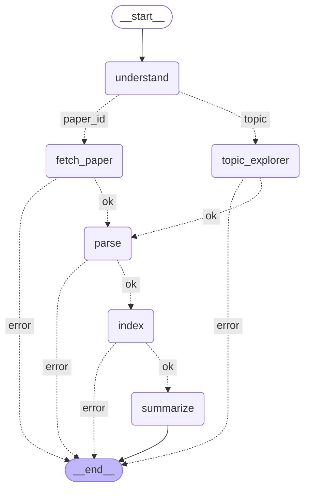
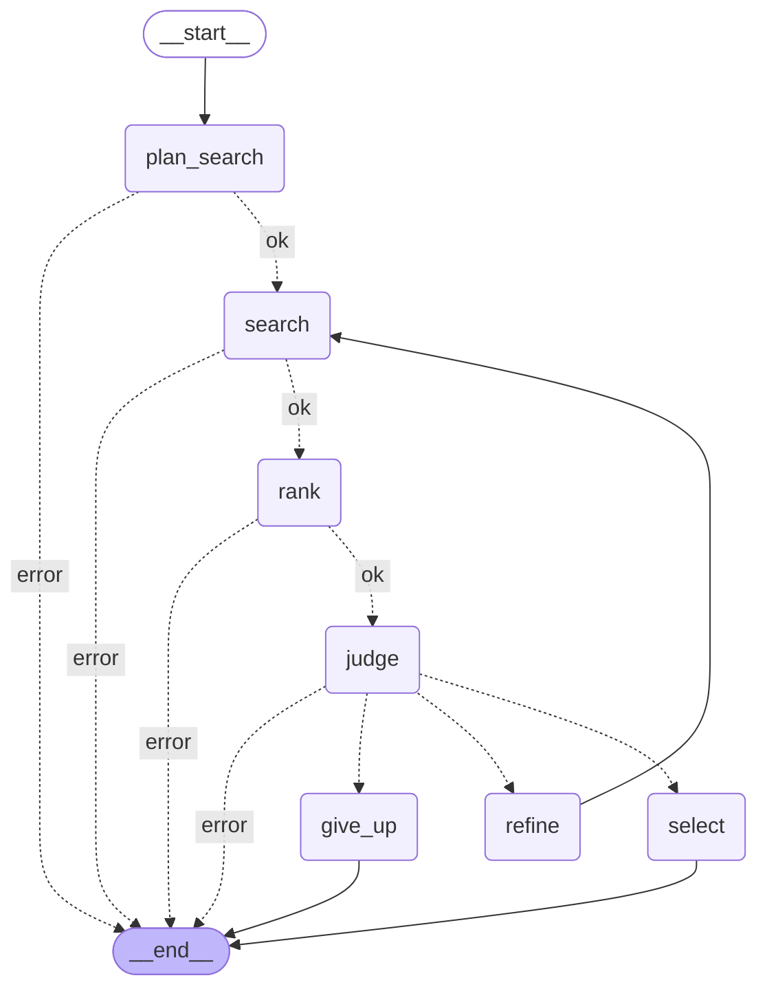
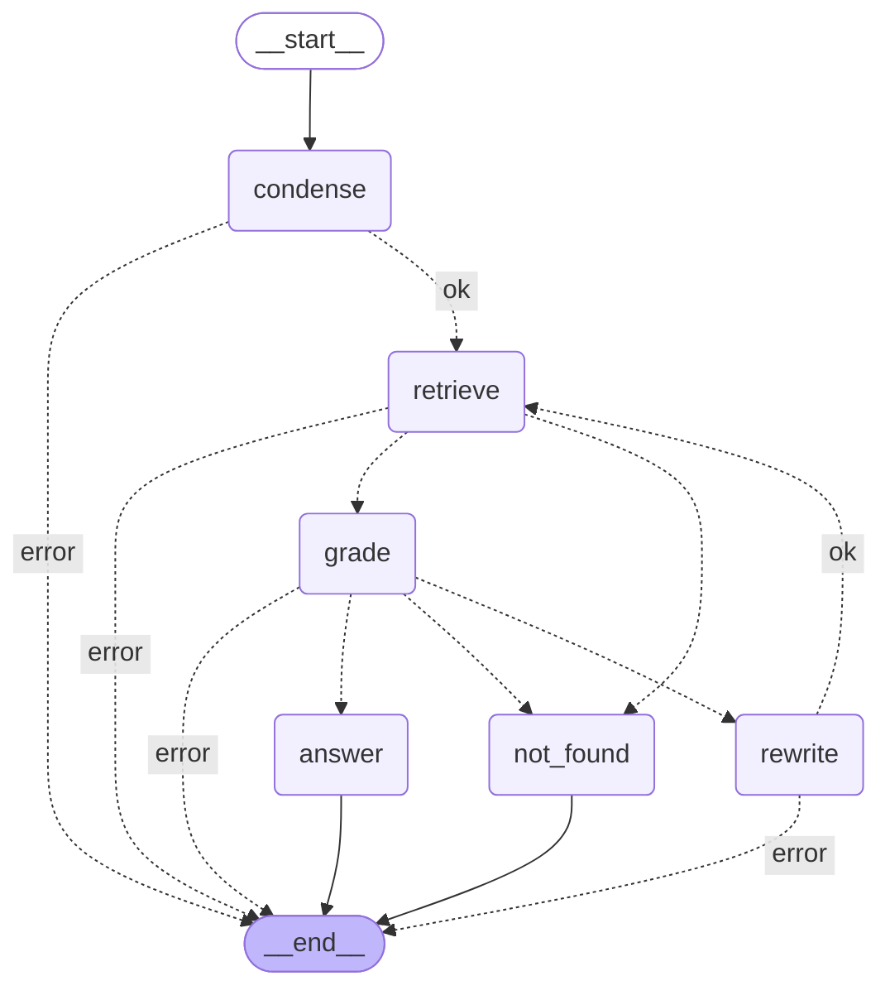

# Agent graphs

Generated from the compiled LangGraph graphs by `python -m demo.run_demo`.

## Paper graph

```mermaid
graph TD;
	__start__([<p>__start__</p>]):::first
	understand(understand)
	topic_explorer(topic_explorer)
	fetch_paper(fetch_paper)
	parse(parse)
	index(index)
	summarize(summarize)
	__end__([<p>__end__</p>]):::last
	__start__ --> understand;
	fetch_paper -. &nbsp;error&nbsp; .-> __end__;
	fetch_paper -. &nbsp;ok&nbsp; .-> parse;
	index -. &nbsp;error&nbsp; .-> __end__;
	index -. &nbsp;ok&nbsp; .-> summarize;
	parse -. &nbsp;error&nbsp; .-> __end__;
	parse -. &nbsp;ok&nbsp; .-> index;
	topic_explorer -. &nbsp;error&nbsp; .-> __end__;
	topic_explorer -. &nbsp;ok&nbsp; .-> parse;
	understand -. &nbsp;paper_id&nbsp; .-> fetch_paper;
	understand -. &nbsp;topic&nbsp; .-> topic_explorer;
	summarize --> __end__;
	classDef default fill:#f2f0ff,line-height:1.2
	classDef first fill-opacity:0
	classDef last fill:#bfb6fc
```

## Topic explorer agent

```mermaid
graph TD;
	__start__([<p>__start__</p>]):::first
	plan_search(plan_search)
	search(search)
	rank(rank)
	judge(judge)
	refine(refine)
	select(select)
	give_up(give_up)
	__end__([<p>__end__</p>]):::last
	__start__ --> plan_search;
	judge -. &nbsp;error&nbsp; .-> __end__;
	judge -.-> give_up;
	judge -.-> refine;
	judge -.-> select;
	plan_search -. &nbsp;error&nbsp; .-> __end__;
	plan_search -. &nbsp;ok&nbsp; .-> search;
	rank -. &nbsp;error&nbsp; .-> __end__;
	rank -. &nbsp;ok&nbsp; .-> judge;
	refine --> search;
	search -. &nbsp;error&nbsp; .-> __end__;
	search -. &nbsp;ok&nbsp; .-> rank;
	give_up --> __end__;
	select --> __end__;
	classDef default fill:#f2f0ff,line-height:1.2
	classDef first fill-opacity:0
	classDef last fill:#bfb6fc
```

## QA agent

```mermaid
graph TD;
	__start__([<p>__start__</p>]):::first
	condense(condense)
	retrieve(retrieve)
	grade(grade)
	rewrite(rewrite)
	answer(answer)
	not_found(not_found)
	__end__([<p>__end__</p>]):::last
	__start__ --> condense;
	condense -. &nbsp;error&nbsp; .-> __end__;
	condense -. &nbsp;ok&nbsp; .-> retrieve;
	grade -. &nbsp;error&nbsp; .-> __end__;
	grade -.-> answer;
	grade -.-> not_found;
	grade -.-> rewrite;
	retrieve -. &nbsp;error&nbsp; .-> __end__;
	retrieve -.-> grade;
	retrieve -.-> not_found;
	rewrite -. &nbsp;error&nbsp; .-> __end__;
	rewrite -. &nbsp;ok&nbsp; .-> retrieve;
	answer --> __end__;
	not_found --> __end__;
	classDef default fill:#f2f0ff,line-height:1.2
	classDef first fill-opacity:0
	classDef last fill:#bfb6fc
```
